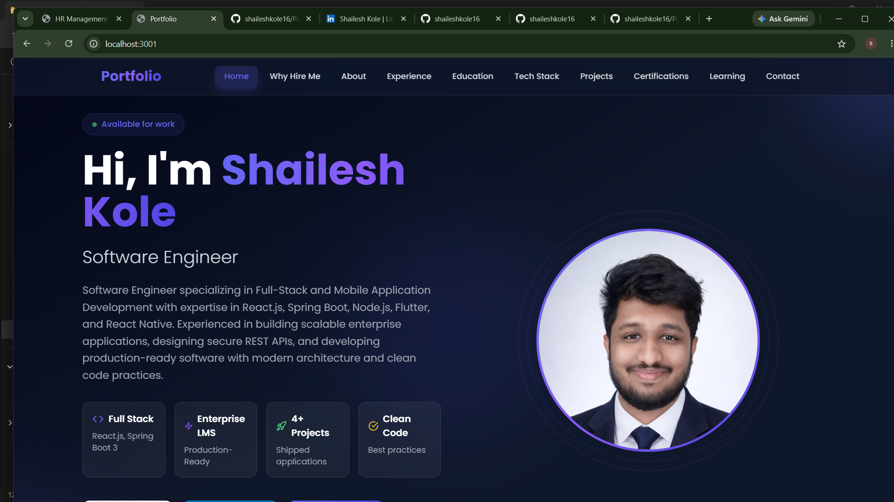
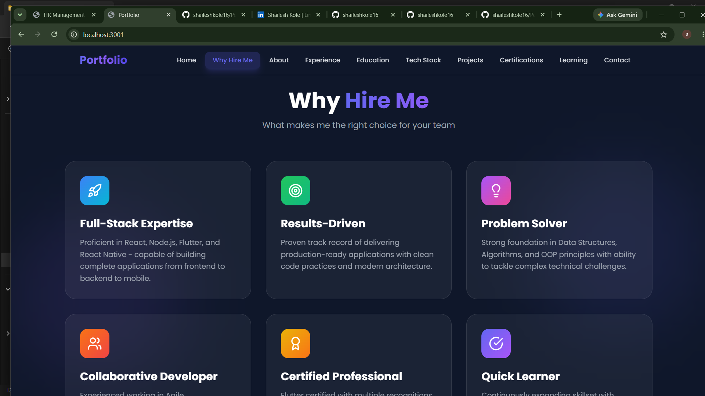
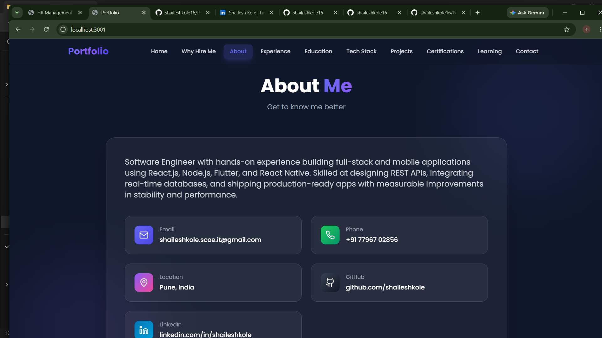
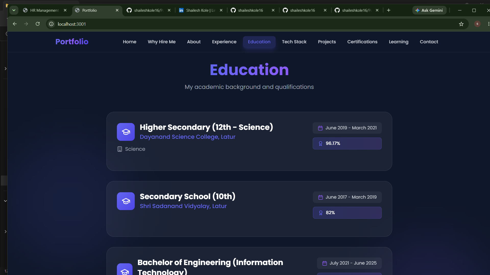
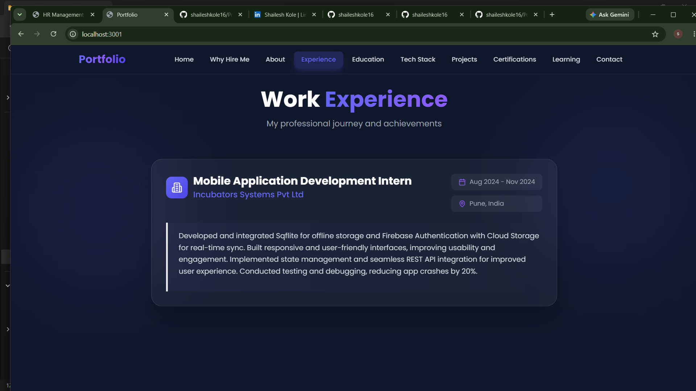
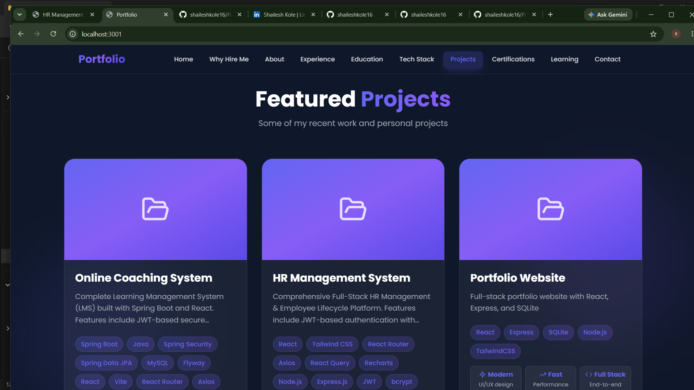
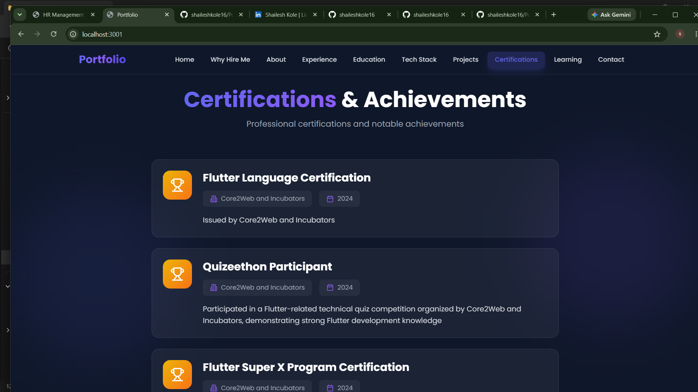

# 🚀 Portfolio Website

<div align="center">


**A modern, full-stack portfolio website built with cutting-edge technologies**

[](#)
[](https://github.com/shaileshkole16/Portfolio/stargazers)
[](https://github.com/shaileshkole16/Portfolio/network/members)
[](LICENSE)

</div>

---

## ✨ Features

- 🎨 **Modern UI/UX** - Beautiful dark theme with smooth animations
- 📱 **Fully Responsive** - Perfect on all devices (mobile, tablet, desktop)
- ⚡ **Fast Performance** - Built with Vite for lightning-fast loading
- 🔒 **Secure** - CORS-enabled API with proper error handling
- 📊 **Dynamic Content** - API-driven content management
- 🎯 **SEO Friendly** - Optimized meta tags and semantic HTML
- 🌙 **Dark Mode** - Premium dark theme with gradient accents
- 📜 **Smooth Scrolling** - Seamless navigation experience

---

## 🛠️ Tech Stack

### Frontend
| Technology | Version | Description |
|------------|---------|-------------|
| React | 18.3.1 | UI Framework |
| Vite | 5.4.8 | Build Tool |
| TailwindCSS | 3.4.12 | CSS Framework |
| Lucide React | Latest | Icon Library |
| React Router | 6.26.1 | Client-side Routing |

### Backend
| Technology | Version | Description |
|------------|---------|-------------|
| Node.js | 18+ | Runtime Environment |
| Express.js | 4.19.2 | Web Framework |
| SQLite3 | Latest | Database |
| CORS | Latest | Cross-Origin Resource Sharing |

---

## 📁 Project Structure

```
portfolio/
├── 📂 backend/
│   ├── server.js              # Express server & API routes
│   ├── package.json           # Backend dependencies
│   ├── portfolio.db           # SQLite database (auto-generated)
│   └── .gitignore
├── 📂 frontend/
│   ├── 📂 public/
│   │   ├── profile.jpeg       # Profile picture
│   │   └── resume.pdf         # Resume file
│   ├── 📂 src/
│   │   ├── 📂 components/
│   │   │   ├── Hero.jsx       # Hero section with profile
│   │   │   ├── About.jsx      # About me section
│   │   │   ├── Experience.jsx # Work experience
│   │   │   ├── Education.jsx  # Education history
│   │   │   ├── TechStack.jsx  # Technology stack
│   │   │   ├── Projects.jsx   # Project showcase
│   │   │   ├── Certifications.jsx # Certifications
│   │   │   ├── Learning.jsx   # Currently exploring
│   │   │   ├── WhyHireMe.jsx  # Why hire me section
│   │   │   ├── Contact.jsx    # Contact form
│   │   │   └── Navbar.jsx     # Navigation bar
│   │   ├── App.jsx            # Main app component
│   │   ├── main.jsx           # Entry point
│   │   └── index.css          # Global styles
│   ├── index.html
│   ├── package.json
│   ├── vite.config.js
│   ├── tailwind.config.js
│   └── postcss.config.js
└── README.md
```

---

## 🚀 Getting Started

### Prerequisites

- [Node.js](https://nodejs.org/) (v16 or higher)
- [npm](https://www.npmjs.com/) or [yarn](https://yarnpkg.com/)

### Installation

1. **Clone the repository**
```bash
git clone https://github.com/shaileshkole16/Portfolio.git
cd Portfolio
```

2. **Install Backend Dependencies**
```bash
cd backend
npm install
```

3. **Install Frontend Dependencies**
```bash
cd ../frontend
npm install
```

### Running the Application

1. **Start the Backend Server**
```bash
cd backend
npm start
```
The backend will run on `http://localhost:5000`

2. **Start the Frontend Development Server**
```bash
cd frontend
npm run dev
```
The frontend will run on `http://localhost:3000`

3. **Open your browser**
Navigate to `http://localhost:3000` to view the portfolio

---

## 📡 API Endpoints

### Profile
```http
GET  /api/profile          # Get profile information
PUT  /api/profile/:id      # Update profile information
```

### Projects
```http
GET    /api/projects       # Get all projects
GET    /api/projects/:id   # Get single project
POST   /api/projects       # Create new project
PUT    /api/projects/:id   # Update project
DELETE /api/projects/:id   # Delete project
```

### Experience
```http
GET    /api/experience       # Get all experience entries
GET    /api/experience/:id   # Get single experience entry
POST   /api/experience       # Create new experience entry
PUT    /api/experience/:id   # Update experience entry
DELETE /api/experience/:id   # Delete experience entry
```

### Contact
```http
POST /api/contact           # Submit contact form
GET  /api/contact           # Get all contact messages (admin)
```

---

## 🗄️ Database Schema

### Profile Table
```sql
CREATE TABLE profile (
  id INTEGER PRIMARY KEY,
  name TEXT,
  title TEXT,
  bio TEXT,
  email TEXT,
  phone TEXT,
  linkedin TEXT,
  github TEXT,
  resume TEXT
)
```

### Projects Table
```sql
CREATE TABLE projects (
  id INTEGER PRIMARY KEY,
  title TEXT,
  description TEXT,
  technologies TEXT,
  imageUrl TEXT,
  githubUrl TEXT,
  liveUrl TEXT,
  createdAt DATETIME
)
```

### Experience Table
```sql
CREATE TABLE experience (
  id INTEGER PRIMARY KEY,
  company TEXT,
  position TEXT,
  location TEXT,
  startDate TEXT,
  endDate TEXT,
  description TEXT,
  createdAt DATETIME
)
```

### Contact Messages Table
```sql
CREATE TABLE contact (
  id INTEGER PRIMARY KEY,
  name TEXT,
  email TEXT,
  subject TEXT,
  message TEXT,
  createdAt DATETIME
)
```

---

## 🎨 Customization

### Update Profile Information

Edit the profile data in `frontend/src/components/Hero.jsx`:

```javascript
const [profile, setProfile] = useState({
  name: 'Your Name',
  title: 'Your Title',
  bio: 'Your bio description',
  email: 'your.email@example.com',
  phone: '+91 XXXXX XXXXX',
  linkedin: 'linkedin.com/in/yourprofile',
  github: 'github.com/yourusername',
  resume: '/resume.pdf',
  profileImage: '/profile.jpeg'
})
```

### Add Your Profile Picture

1. Place your profile picture in `frontend/public/`
2. Name it `profile.jpeg` or update the path in Hero.jsx
3. Supported formats: JPEG, PNG, JPG

### Add Your Resume

1. Place your resume PDF in `frontend/public/`
2. Name it `resume.pdf` or update the path in Hero.jsx

### Update Projects

Edit the projects array in `frontend/src/components/Projects.jsx`:

```javascript
{
  id: 1,
  title: 'Your Project',
  description: 'Project description',
  technologies: 'React, Node.js, MongoDB',
  imageUrl: '',
  githubUrl: 'https://github.com/yourusername/project',
  liveUrl: 'https://yourproject.com',
  impact: [
    { metric: '100+', label: 'Users', icon: <Users size={16} /> },
    { metric: 'Fast', label: 'Performance', icon: <Zap size={16} /> }
  ]
}
```

---

## 🏗️ Building for Production

### Frontend Build
```bash
cd frontend
npm run build
```
The built files will be in the `dist/` directory.

### Backend Production
The backend is production-ready. Consider:
- ✅ Set up environment variables for sensitive data
- ✅ Use a production database (PostgreSQL, MySQL)
- ✅ Add authentication for admin endpoints
- ✅ Deploy to hosting services (Vercel, Netlify, Heroku)

---

## 📸 Screenshots

<div align="center">

### Home Section


### Why Hire Me


### About Me


### Education


### Work Experience


### Tech Stack


### Projects


### Certifications


### Currently Exploring


### Let's Connect


</div>

---

## 🌐 Deployment

### Deploy to Vercel (Frontend)

```bash
cd frontend
npm install -g vercel
vercel
```

### Deploy to Render/Railway (Backend)

1. Push code to GitHub
2. Connect your repository to Render/Railway
3. Configure build settings
4. Deploy!

---

## 🤝 Contributing

Contributions are welcome! Please feel free to submit a Pull Request.

1. Fork the repository
2. Create your feature branch (`git checkout -b feature/AmazingFeature`)
3. Commit your changes (`git commit -m 'Add some AmazingFeature'`)
4. Push to the branch (`git push origin feature/AmazingFeature`)
5. Open a Pull Request

---

## ‍💻 Author

**Shailesh Kole**

- [GitHub](https://github.com/shaileshkole16)
- [LinkedIn](https://linkedin.com/in/shailesh-kole-3195b2289)
- [Email](mailto:shaileshkole.scoe.it@gmail.com)

---

## ⭐ Show Your Support

If you like this project, please give it a ⭐ on GitHub!

<div align="center">

**Built with ❤️ by Shailesh Kole**

[](#readme)

</div>

